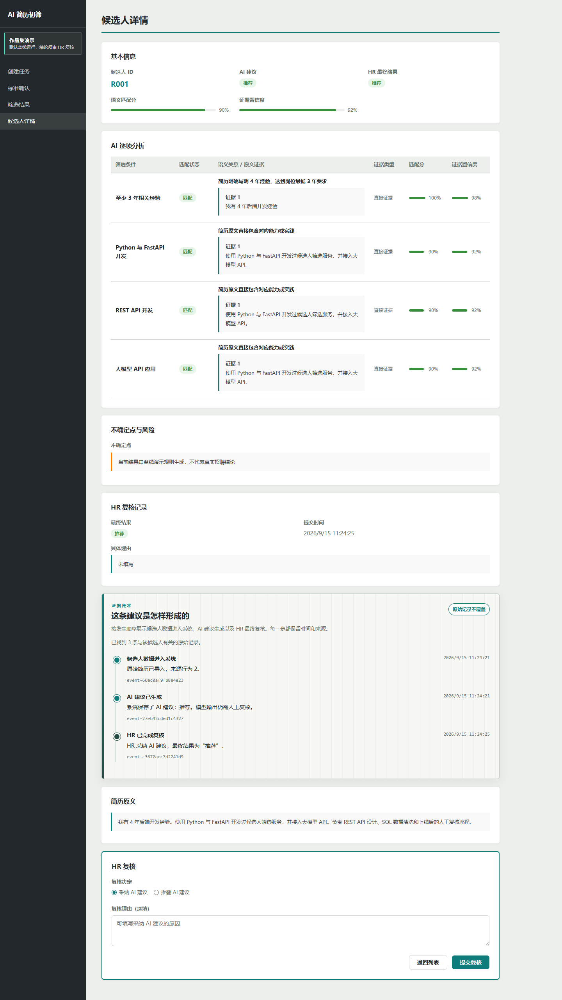

# AI 简历初筛与人工复核系统

面向 AI 应用岗位的项目：不是让模型替 HR 做决定，而是把“岗位要求—模型建议—原文证据—人工复核”串成一条可追溯的业务链路。



> 默认启用离线演示模式，不需要 API Key、不会产生模型费用。演示结果由固定规则生成，只用于验证产品流程，不能用于真实招聘判断。

## 亮点

- **证据约束**：每项判断都携带简历原文引用；引用无法定位时，后端会降级结果，而不是相信模型自报。
- **Human-in-the-loop**：AI 只给建议，HR 可以采纳或推翻；推翻必须说明理由，原建议不被覆盖。
- **可审计**：导入、分析、失败和人工复核均追加写入审计事件；详情页用“证据账本”展示事件链。
- **工程边界**：模型适配器、业务用例、领域规则与文件存储解耦；单份失败不会破坏整批任务。
- **零成本演示**：`DemoLLM` 与真实模型共用同一端口和业务链路，方便任何人在本地体验。

## 3 分钟体验

Windows 下双击 `start.cmd`，或在 PowerShell 7 中运行：

```powershell
.\start.cmd
```

首次启动会创建虚拟环境、安装依赖并由 `.env.example` 生成 `.env`。浏览器打开后上传：

```text
data/sample/resumes_demo.csv
```

依次完成：创建任务 → 确认条件 → 启动分析 → 查看候选人证据 → HR 复核 → 查看证据账本。

只做环境检查：

```powershell
.\start.cmd --check
```

## 使用真实模型

把 `.env` 中的 `DEMO_MODE` 改为 `false`，再填写兼容 OpenAI `/chat/completions` 的模型配置：

```env
DEMO_MODE=false
LLM_API_KEY=请填写真实密钥
LLM_BASE_URL=https://模型服务地址/v1
LLM_MODEL=模型名称
```

`.env` 已被忽略，不要把真实密钥提交、截图或发送给他人。

## 技术结构

```text
CSV/JD
  ↓
FastAPI 接口 → 应用用例 → 领域规则 → JSON/JSONL 文件存储
                    ↓
          DemoLLM / 真实模型适配器
                    ↓
        证据校验 → AI 建议 → HR 复核 → 审计事件
```

技术栈：Python、FastAPI、Pydantic、原生 JavaScript、JSON/JSONL、pytest、Playwright。

详细说明见 [系统设计](docs/architecture.md) 与 [后端运行说明](src/backend/README.md)。

## 自动化验证

```powershell
.\.venv\Scripts\python.exe -m pytest .\src\backend\tests -q --basetemp .pytest-tmp
```

测试结果为 **42 passed**，并通过完整浏览器链路验证。测试使用模拟模型或离线演示模型，不调用付费接口。文件存储版本必须使用单 worker 启动，避免多个进程同时改写同一份 JSON/JSONL。

## 能力边界

这是业务原型，不证明真实招聘准确率、公平性或生产级并发能力。简历正文仍可能包含敏感信息；用于真实业务前，还需要补充脱敏、权限控制、数据库、长期监控和公平性评估。
